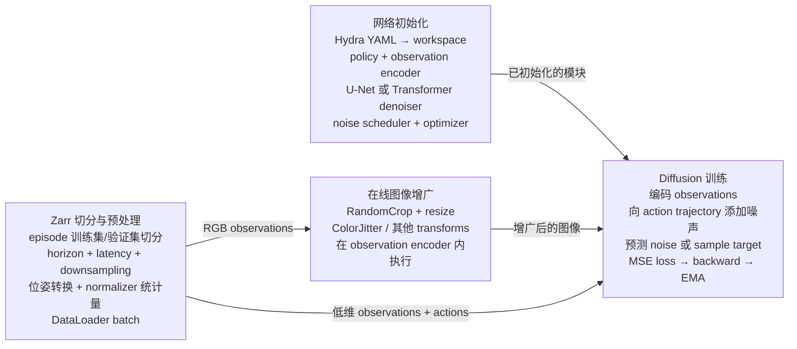

# UMI Mini

这是一个精简版的 [Universal Manipulation Interface（UMI）](https://umi-gripper.github.io/) 仓库，用于在处理完成的 UMI 数据集上训练 Diffusion Policy。原项目详情参见 [UMI 论文](https://umi-gripper.github.io/#paper)。

## 安装

本项目已在 Ubuntu 22.04 上测试。首先安装系统依赖：

```bash
sudo apt install -y libosmesa6-dev libgl1-mesa-glx libglfw3 patchelf libspnav-dev libomp-dev exiftool
```

安装 [uv](https://docs.astral.sh/uv/getting-started/installation/)，然后创建 Python 环境并安装依赖：

```bash
uv python install 3.11
uv sync
```

项目使用 CUDA 12.8 索引中的 PyTorch wheel。使用 GPU 训练时，需要安装兼容的 NVIDIA 驱动。

## 训练

准备处理完成的 UMI Zarr 数据集，然后运行 UMI 训练配置：

```bash
uv run python train.py \
    --config-name=train_diffusion_unet_timm_umi_workspace \
    task.dataset_path=/path/to/dataset.zarr.zip
```

使用多张 GPU 训练：

```bash
uv run accelerate launch \
    --num_processes <number-of-gpus> train.py \
    --config-name=train_diffusion_unet_timm_umi_workspace \
    task.dataset_path=/path/to/dataset.zarr.zip
```

可以使用原项目提供的[杯子排列任务数据集](https://real.stanford.edu/umi/data/zarr_datasets/)进行训练。本仓库不包含数据采集或 SLAM 预处理脚本。

## 训练如何初始化

训练配置由 Hydra 根据顶层实验 config 和 task config 组合生成。例如：

```bash
uv run python train.py \
    --config-name=train_diffusion_unet_timm_umi_workspace \
    task.dataset_path=/path/to/dataset.zarr.zip
```

初始化流程如下：

1. `train.py` 加载 `diffusion_policy/config/<config-name>.yaml`，并解析其中所有 Hydra 插值。
2. 顶层 `_target_` 指定并实例化训练 workspace。
3. workspace 实例化 `cfg.policy`；policy 再根据各自的 `_target_` 实例化 diffusion scheduler 和 observation encoder。
4. workspace 实例化 `cfg.task.dataset`，创建训练与验证 DataLoader，计算数据集 normalizer，并将其设置到 policy 中。
5. epoch 循环开始前，model、optimizer、scheduler 和 DataLoader 会交给 Hugging Face Accelerate。若 `training.use_ema: true`，还会创建一份 policy 的 EMA 副本。

两条初始化分支最终在训练环节汇合：



图像增广属于 model forward，而不是离线 Zarr 转换步骤。只有 RGB observations 会经过图像增广；低维 observations 和 actions 从准备好的 batch 直接进入归一化和 Diffusion 训练。

不修改 YAML 也可以通过命令行覆盖 Hydra 配置。例如：

```bash
uv run python train.py \
    --config-name=train_diffusion_unet_timm_umi_workspace \
    task.dataset_path=/path/to/dataset.zarr.zip \
    dataloader.batch_size=32 \
    training.num_epochs=200 \
    policy.obs_encoder.pretrained=false
```

### 选择神经网络架构

通过顶层 config 名称选择 denoiser 架构。不能只修改类似 `model: unet` 的单个字符串，因为每份 config 都指定了一组互相兼容的 workspace、policy 和 observation encoder。

| 架构 | Config 名称 | Denoiser | Observation conditioning |
| --- | --- | --- | --- |
| 1-D U-Net | `train_diffusion_unet_timm_umi_workspace` | `ConditionalUnet1D` | 将 Timm 图像特征与低维 observations 展平并拼接为一个 global condition vector。 |
| Transformer | `train_diffusion_transformer_umi_workspace` | `TransformerForActionDiffusion` | 将图像特征与低维 observations 投影为 `n_emb` tokens，作为 conditioning tokens 输入。 |

两种架构进行 Diffusion 的对象都是 **action trajectory**，而不是相机图像。相机 encoder 负责生成 observation condition，用于对 action trajectory 去噪。

U-Net 配置中的关键 Hydra targets 为：

```yaml
_target_: diffusion_policy.workspace.train_diffusion_unet_image_workspace.TrainDiffusionUnetImageWorkspace

policy:
  _target_: diffusion_policy.policy.diffusion_unet_timm_policy.DiffusionUnetTimmPolicy
  noise_scheduler:
    _target_: diffusers.DDIMScheduler
  obs_encoder:
    _target_: diffusion_policy.model.vision.timm_obs_encoder.TimmObsEncoder
```

Transformer 配置会替换以下三个项目 targets：

```yaml
_target_: diffusion_policy.workspace.train_diffusion_transformer_timm_workspace.TrainDiffusionTransformerTimmWorkspace

policy:
  _target_: diffusion_policy.policy.diffusion_transformer_timm_policy.DiffusionTransformerTimmPolicy
  noise_scheduler:
    _target_: diffusers.DDIMScheduler
  obs_encoder:
    _target_: diffusion_policy.model.vision.transformer_obs_encoder.TransformerObsEncoder
```

架构相关参数位于 `policy` 下。例如，U-Net 使用 `diffusion_step_embed_dim`、`down_dims`、`kernel_size` 和 `n_groups`；Transformer 使用 `n_layer`、`n_head`、`n_emb` 和 `p_drop_attn`。

视觉 backbone 由 `policy.obs_encoder.model_name` 单独选择，可以使用受支持的 Timm ViT、ResNet 或 ConvNeXt 模型。`pretrained` 控制是否加载预训练权重，`frozen` 控制是否冻结 backbone 参数。

仓库中的双臂配置使用 `task: umi_bimanual`。task config 负责定义 observation keys、shape、horizon 和最终 action dimension；policy 通过 `shape_meta: ${task.shape_meta}` 读取这些值。

## 从 Zarr 数据到 Diffusion 训练 batch

处理完成的数据集应是压缩的 Zarr store，逻辑结构如下：

```text
dataset.zarr.zip
├── data/
│   ├── camera0_rgb
│   ├── robot0_eef_pos
│   ├── robot0_eef_rot_axis_angle
│   ├── robot0_gripper_width
│   └── action                 # 可选；缺失时根据 robot state 重建
└── meta/
    └── episode_ends
```

一次训练实际读取哪些 keys，由 task config 中的 `shape_meta` 声明。因此，Zarr keys 必须与 YAML 中的 keys 一致。单个训练样本按以下步骤生成：

1. `UmiDataset` 打开 zip store，并将其复制到内存中的 Zarr store。如果设置了 `cache_dir`，则会创建或复用由文件锁保护的 LMDB cache。
2. 根据 `val_ratio` 和 `seed`，以 episode 为单位切分训练集和验证集。
3. `SequenceSampler` 将每个符合条件的时间索引转换为一个样本。对于每个 key，它会应用 YAML 中配置的 `horizon`、`latency_steps` 和 `down_sample_steps`。若 episode 起始位置缺少历史 observation，则使用第一个可用帧向前填充。Action sequence 从当前索引向未来截取，并可在 episode 末尾选择性填充。
4. 对带有非整数 latency 的低维信号进行插值，其中旋转向量使用球面插值。RGB 数组在样本被请求前一直以压缩形式保留在 Zarr 中。
5. `UmiDataset.__getitem__` 将 RGB 从 `T,H,W,C` uint8 转换为 `[0,1]` 范围内的 `T,C,H,W` float32。末端执行器 observations/actions 会转换为配置的 pose representation，旋转则输出为 6-D representation。返回的数据结构为：

   ```text
   batch["obs"][observation_key]  # 经 DataLoader 组 batch 后为 B,T,...
   batch["action"]                # B,action_horizon,action_dim
   ```

6. 训练开始前，`get_normalizer()` 会扫描训练样本。Position 和 gripper 数据采用 range normalization，6-D rotation 使用 identity normalizer，图像保持在 `[0,1]`。生成的 normalizer 会保存为运行目录中的 `normalizer.pkl`，并由每个 Accelerate process 加载。
7. 在 `policy.compute_loss` 中，observations 和 actions 首先被归一化。Observation encoder 随后生成一个 global condition vector（U-Net）或一组 conditioning tokens（Transformer）。程序随机采样 diffusion timestep 和 Gaussian noise，由 scheduler 对归一化后的 action trajectory 加噪；denoiser 最终通过 MSE 学习配置的预测目标，本仓库默认配置为 `epsilon`。

### 图像增广在哪里执行

图像增广在 `policy.obs_encoder.transforms` 中配置。例如：

```yaml
policy:
  obs_encoder:
    transforms:
      - type: RandomCrop
        ratio: 0.95
      - _target_: torchvision.transforms.ColorJitter
        brightness: 0.3
        contrast: 0.4
        saturation: 0.5
        hue: 0.08
```

Hydra 会实例化标准 Torchvision transforms。自定义的 `RandomCrop` 项会由 observation encoder 展开为 `RandomCrop(0.95 * image_size)`，然后 resize 回配置的图像尺寸。

DataLoader batch 进入 policy 后，transforms 会在 `TimmObsEncoder.forward()` 或 `TransformerObsEncoder.forward()` 中、进入 Timm visual backbone 前执行。因此，图像增广不会修改 Zarr 数据集或 cache 中的样本。

当前实现无论 module 处于 training mode 还是 evaluation mode，都会调用 transform pipeline。因此，配置的 random crop、`ColorJitter` 以及其他随机 transforms 也会在验证和 action prediction 时运行。需要确定性评估时，应从 config 中移除随机 transforms，或者修改 encoder，使其仅在 `self.training` 为 true 时执行这些 transforms。

## 许可证

本项目基于 [MIT License](LICENSE) 发布，并基于原始 [UMI 项目](https://umi-gripper.github.io/)开发。
